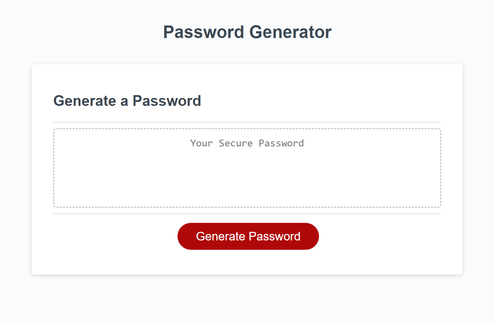
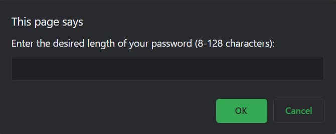

# <Password-generator>

## Description

- This project was built in order to generate a password which contains a series of promts to be answered and given a secure password.
- This purpose of this project is to allow for a secure resource for protected passwords.
- During this project, I solved many problems in JavaScript and it has given me knowledge about how to complete technical projects in the future.

## Usage

Below is the deployed webpage:

[Password Generator](https://matthewstandish.github.io/password-generator/)

When the "Generate Password" button is clicked:

An alert will appear on the page with the first promt for password criteria:

You will now complete each prompt.

When all prompts are completed:

A new password is generated that matches the selected criteria.

## Features

An alert is displayed on screen with a series of prompts to complete.
